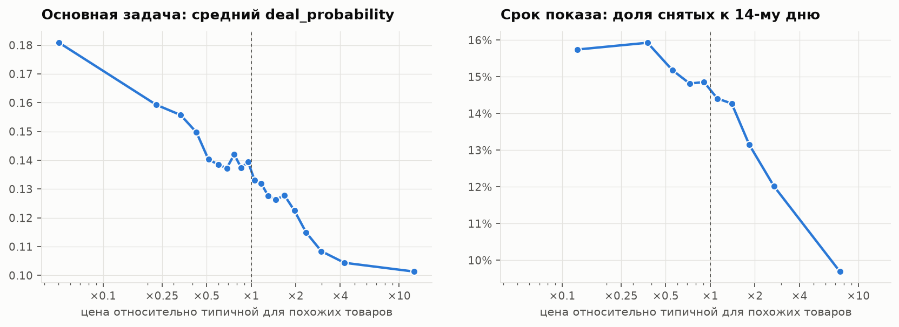
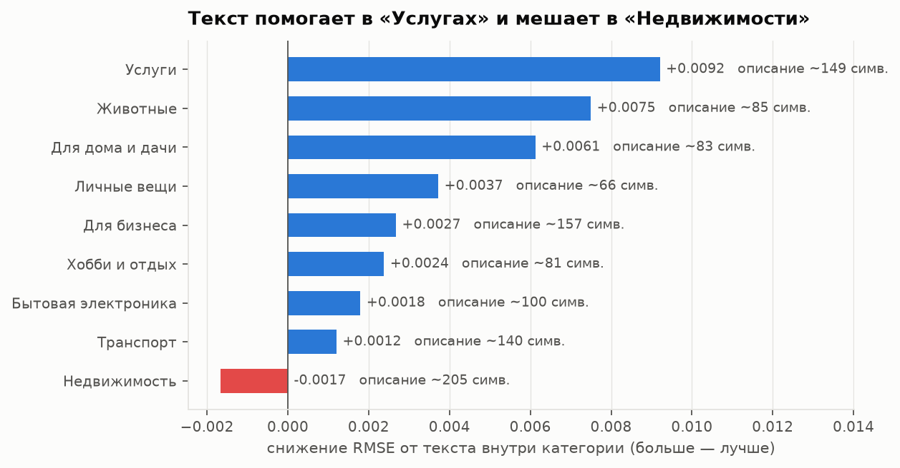
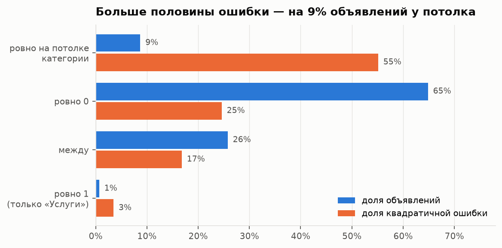

# Avito Demand Prediction: что решает судьбу объявления — цена, фото или текст

Данные — соревнование Kaggle [Avito Demand Prediction Challenge](https://www.kaggle.com/c/avito-demand-prediction):
1.5 млн объявлений Avito за март 2017 года, 47 категорий. Нужно предсказать `deal_probability` —
по описанию Avito, вероятность того, что объявление приведёт к сделке. Метрика — RMSE.

Цель проекта — не место на лидерборде, а проверяемый ответ на вопрос, **что на самом деле двигает
результат**: цена, фотография или то, как написан текст. Поэтому везде одна модель (CatBoost) и один
протокол обучения, валидация по времени, а каждое сравнение — с доверительным интервалом по парному
бутстрепу. Отрицательный результат, измеренный честно, тоже считается результатом.

Весь код и выводы — в [`avito_demand_prediction.ipynb`](avito_demand_prediction.ipynb).

**Стек:** Python, pandas, CatBoost, scikit-learn (TF-IDF, SVD, изотоническая регрессия),
PyTorch + transformers (`rubert-tiny2`, дообучение энкодера), Pillow; анализ выживаемости
(Каплан–Мейер) и бутстреп написаны вручную.

## Коротко

- **Таргет — не вероятность.** 65% значений ровно ноль, у каждой категории свой потолок, и 9% объявлений
  сидят ровно на нём. Эта находка потом объяснит больше половины ошибки модели.
- **Цена обманывает.** По всем данным «дороже — лучше», внутри категорий — наоборот. Правильный признак —
  отклонение от типичной цены похожего товара, и вывод «дешевле типичного — уходит быстрее»
  подтверждается на независимой выборке через срок показа объявления.
- **Текст: TF-IDF бьёт эмбеддинги**, а эффект текста разнонаправлен по категориям: в «Услугах» помогает
  сильнее всего, в «Недвижимости» мешает. Это воспроизвелось в двух независимых заходах.
- **Фото: важно, *что* на снимке, а не *как* он снят.** Готовый код содержимого от Avito — самый сильный
  одиночный признак проекта; одиннадцать признаков качества съёмки поверх него почти ничего не добавляют.
- **55% ошибки — на 9% объявлений** у потолка категории. Двухчастная модель «сработает ли × насколько»
  забирает часть этого резерва.
- **Лучшая модель — RMSE 0.2225**, минус 14% к константе. Простая табличка без текста и фото сама
  проходит почти две трети пути от константы до победителя соревнования.

## Как меряем

- **Сплит по времени.** Обучение — 15–21 марта, проверка — 22–28 марта, обе недели ровно среда–вторник.
  Тест соревнования лежит на 15 дней позже, общих объявлений с обучением у него нет. Случайный сплит
  развёл бы почти одинаковые объявления одного продавца по обучению и проверке и завысил бы качество.
- **Ранняя остановка — по последнему дню обучающей недели**, валидация в подборе числа деревьев не участвует.
- **Один протокол на все строки таблицы** (глубина 8, learning rate 0.1): строки отличаются признаками,
  а не настройками. Медленный протокол (lr 0.05) точнее на 0.00012 — это измерено и держится в голове
  при чтении мелких эффектов.
- **Парный бутстреп** для каждого сравнения: приросты здесь в третьем-четвёртом знаке, и без интервала
  реальное улучшение не отличить от шума.

## Результаты

RMSE на валидационной неделе. Δ — разница с предыдущей строкой внутри блока по парному бутстрепу;
все Δ в таблице значимы (95% интервал не накрывает ноль).

| | RMSE | Δ |
|---|---|---|
| **База** | | |
| константа (среднее по обучению) | 0.25978 | |
| среднее по категории и региону | 0.24256 | |
| CatBoost, вся табличка | 0.22878 | |
| **Текст, поверх таблички** | | |
| + простые признаки (длина, регистр, цифры) | 0.22750 | −0.00128 |
| + TF-IDF по словам и символьным n-граммам | 0.22554 | −0.00196 |
| + эмбеддинги `rubert-tiny2` | 0.22519 | −0.00035 |
| **Фото, поверх таблички** | | |
| + есть ли фото | 0.22818 | −0.00061 |
| + `image_top_1` (код содержимого от Avito) | 0.22496 | −0.00322 |
| + 11 своих признаков качества съёмки | 0.22449 | −0.00046 |
| **Всё вместе** \* | | |
| табличка + текст + `image_top_1` (вариант A) | 0.22321 | |
| + словари по категориям, дообученный энкодер (E) | 0.22278 | −0.00042 |
| двухчастная модель | **0.22254** | −0.00024 |

\* Отдельный прогон: база накопительная, но без ценового остатка и гео, протокол короче (до 3000 деревьев).
Сравнивать строки только внутри блока.

## Цена

Сырая цена обманывает. По всем данным её связь с результатом положительная (Спирмен +0.216), внутри
категорий — отрицательная (медиана −0.040, отрицательная в 65% категорий). Дорогие категории —
недвижимость, авто — в среднем срабатывают чаще, и это перебивает то, что внутри категории дешёвое
уходит быстрее. Поверить общей корреляции — сделать вывод, обратный правде.

Правильный признак — отклонение от типичной цены похожего товара. Для этого строится отдельная
гедоническая модель цены (приём из экономики недвижимости): категория, параметры товара, регион,
тип продавца — и намеренно без текста и фото, чтобы остаток не впитал сигнал спроса. Она объясняет
82.5% разброса логарифма цены, а остаток — это «дорого или дёшево относительно себе подобных».



Слева основная задача, справа — совсем другие объявления и другой таргет: срок показа из таблицы
`periods_train`. Там 89% наблюдений цензурированы (объявление ещё висит к концу окна), поэтому
среднее считать нельзя — считается кривая дожития Каплана–Мейера. Вывод один и тот же: самые дешёвые
относительно типичной снимаются к 14-му дню в 1.62 раза чаще самых дорогих, в основной задаче края
кривой отличаются в 1.78 раза. Это наблюдательная зависимость, а не причинная: цены никто не рандомизировал.

В метрике же почти ничего: остаток добавляет −0.00008, а заменить им цену хуже (+0.00031). CatBoost
и так вытаскивает почти всё это через категориальные статистики. Ценность шага — в понимании, а не в приросте.

## Текст



Самый большой вклад — TF-IDF поверх простых статистик. Эмбеддинги `rubert-tiny2` вместо TF-IDF хуже
(+0.00056), вместе с ним дают небольшую добавку. Для короткого объявления важнее, какие именно слова
написаны, чем общий смысл.

Интереснее разбивка по категориям. В «Услугах» описание — единственный источник информации о том,
что продают, и текст помогает сильнее всего. В «Недвижимости» он делает хуже, хотя описания там самые
длинные: они шаблонные, а всё существенное уже лежит в структурированных полях.

Второй заход проверил три способа выжать из текста больше: свой словарь на каждую категорию,
энкодер, дообученный на самой задаче, и отклонение текста от типичного для категории. Вместе они дали
−0.00042; дообучение энкодера (полтора часа на GPU) себя не окупило, отклонение от категории — ноль.
Но разбивка по категориям повторила первый заход на других признаках: «Животные» и «Услуги» в плюсе,
«Недвижимость» и «Для бизнеса» в минусе. Единая обработка текста для всех категорий — тупик.

## Фото

Готовый признак `image_top_1` — код класса содержимого фото от самого Avito — даёт −0.00322, больше
любого другого одиночного признака. Для своих признаков качества (резкость, цветность, пересветы,
доля тёмного) пришлось пройти по всем 1.4 млн фотографий из архива на десятки гигабайт; поверх
`image_top_1` они добавляют лишь −0.00046. «Сфоткай получше» решает мало, важно, что на фото.

## Гео и утечка через target encoding

Гео-признаки дают −0.00011. Кодирование города через средний таргет проверено в трёх вариантах честности:

| кодирование | против таблички |
|---|---|
| out-of-fold по случайным фолдам | +0.00037 |
| по времени (только прошлые дни) | +0.00029 |
| наивное (строка видит свой таргет) | +0.00163 |

Наивное хуже честного в 4.4 раза — классическая тихая утечка. Но главное: хуже базы все три.
CatBoost сам считает такие статистики, упорядоченно и без утечки, а ручное кодирование их дублирует.

## Калибровка

Основной таргет калибровать бессмысленно — он не частота события. Зато в данных есть настоящее
бинарное событие «ноль или не ноль». Классификатор на нём откалиброван из коробки: AUC 0.808,
ECE 0.005; изотоническая регрессия делает только хуже (0.0056). Такую вероятность можно сразу
ставить в пороговое решение.

## Где ошибка и что с ней делать



Больше половины квадратичной ошибки — на объявлениях ровно у потолка категории: модель занижает их
в среднем на 0.54. Для RMSE-модели значение 0.8 выглядит выбросом, и она тянет его к среднему.
Худшая категория — «Услуги» (RMSE 0.319 против 0.160 у недвижимости).

Отсюда третий заход — бить в форму таргета, а не в признаки:

- объявления у потолка **отличимы заранее**: классификатор даёт AUC 0.82, среди его топ-10% кандидатов
  у потолка реально 39% против базовых 10%. Значит, резерв есть;
- **двухчастная модель** P(y > 0) × E[y | y > 0] дала −0.00024 — больше всего в «Для бизнеса»,
  «Недвижимости» и «Услугах», где сделок много и разделение информативно;
- нормировка на потолок категории и маскирование текста там, где он вредил, дали ноль: дерево
  само умеет не использовать текст там, где он не нужен.

## Итог

Лучшая модель — RMSE 0.22254 против 0.25978 у константы: минус 14% по RMSE, около 27% объяснённой
дисперсии. Остальное — вещи, которых в данных нет. Для масштаба: на публичном лидерборде (1870 команд)
победитель — 0.2106, медиана — 0.2226. Путь от константы до победителя простая табличка проходит на 63%,
лучшая модель — на 76%. Сравнение приблизительное: валидация — мартовская неделя, лидерборд — апрельский тест.

**Что дальше.** Собрать одну сквозную модель на полной базе (двухчастная модель считалась без ценового
остатка и гео); строить текстовые признаки только там, где текст решает, или дать модели явную связку
«категория × текст»; добавить агрегаты по продавцу. Для сабмита нужны признаки фото и для тестового архива —
он не обрабатывался, поэтому сабмит не отправлялся.

## Структура

```
avito_demand_prediction.ipynb   весь код и выводы: 16 секций от данных до итогов
results/                        все посчитанные числа (JSON); по ним строятся графики и сводки
figures/                        графики из ноутбука
requirements.txt
```

## Запуск

Данные в репозиторий не входят (правила соревнования). Нужно принять правила на
[странице соревнования](https://www.kaggle.com/c/avito-demand-prediction/rules), положить токен Kaggle
в `~/.kaggle/kaggle.json` и поставить зависимости:

```bash
pip install -r requirements.txt
```

Дальше Run All: первая ячейка секции 1 сама скачает CSV в `data/raw/`. Основной прогон — несколько часов
на многоядерной CPU-машине. Тяжёлые шаги выключены флагами в первой ячейке:

- `RUN_GPU` — эмбеддинги текста, нужен GPU;
- `RUN_IMAGES` — признаки фото, нужен `train_jpg.zip` в `data/raw/` и Linux (пул процессов через fork);
- `RUN_EXTRA` — срок показа по цене (`train_active.csv`, 9 ГБ), второй заход на текст с дообучением
  энкодера (GPU) и двухчастная модель.

С выключенными флагами секции 8–9 подхватывают готовые признаки из `data/in/`, если они есть, а если нет —
считаются без эмбеддингов и признаков фото. Сводки секций 11, 14 и 15 читаются из `results/`.
